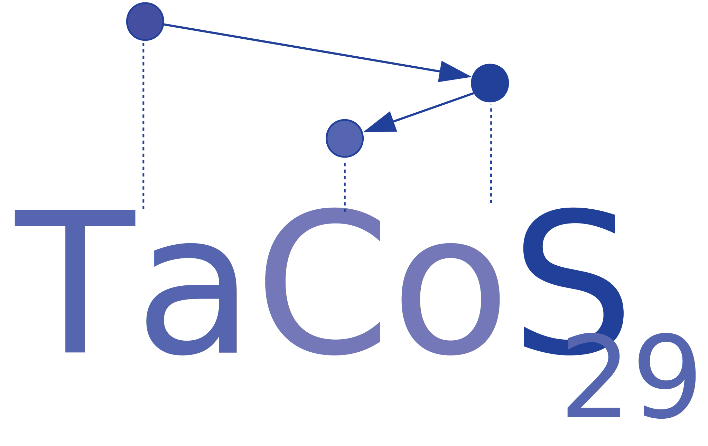

  

    

        
       <h1 class="hero-title">June 21st - 23rd, Saarbrücken </h1>
    

  

  

    

    <h2>Beware, this site is under construction! #UnderConstruction</h2>
    

  

  

    

      <h2>About TaCoS 29</h2>

We are excited to host the TaCoS 29 (Tagung der Computerlinguistik-Studierenden) in Saarbrücken this year. TaCoS is a conference series dating back to the 90s that is open to any student interested in the areas of computational linguistics and natural language processing as well as its neighboring applied and theoretical disciplines from psycholinguistics to computer science.

As such, the topics covered at TaCoS are very broad. To get an impression of the variety, have a look at the [schedule from last year](/images/old_schedule.pdf)  in Potsdam.

While the time at TaCoS is mainly spent on scientific exchange, it's also a great place to get to know each other better and build bridges.

If you have performed any research you consider interesting (e.g. a thesis, a personal or in-class project, some work in context of your Hiwi job), please consider [presenting](/call/) it.

We hope to welcome as many of you as possible and hope you'll have a great time here in Saarbrücken.

    

  

  

    

        <h2>Timeline</h2>

<table class="timeline-table">
  <tr>
    <th>Date</th>
    <th>Event</th>
  </tr>
  <tr>
    <td>April 25</td>
    <td>Registration opens</td>
  </tr>
  <tr>
    <td>- May 26 (only <strong id="early_bird"></strong> left)</td>
    <td>Early Bird Registration (registration fee X 20€)</td>
  </tr>
  <tr>
    <td>- June 9 (<strong id="registration"></strong> left)</td>
    <td>Registration Period (registration fee 25 €)</td>
  </tr>
  <tr>
    <td>- June 9 (<strong id="presentation"></strong> left)</td>
    <td>Call for Presentations</td>
  </tr>
    <tr>
    <td>June 21-23 (in <strong id="tacos"></strong>)</td>
    <td>TaCoS 29</td>
  </tr>
</table>
    

  

  

  

    

        <h2>Sponsors</h2>
        <ul>
        

            
        

        </ul>
    

  

