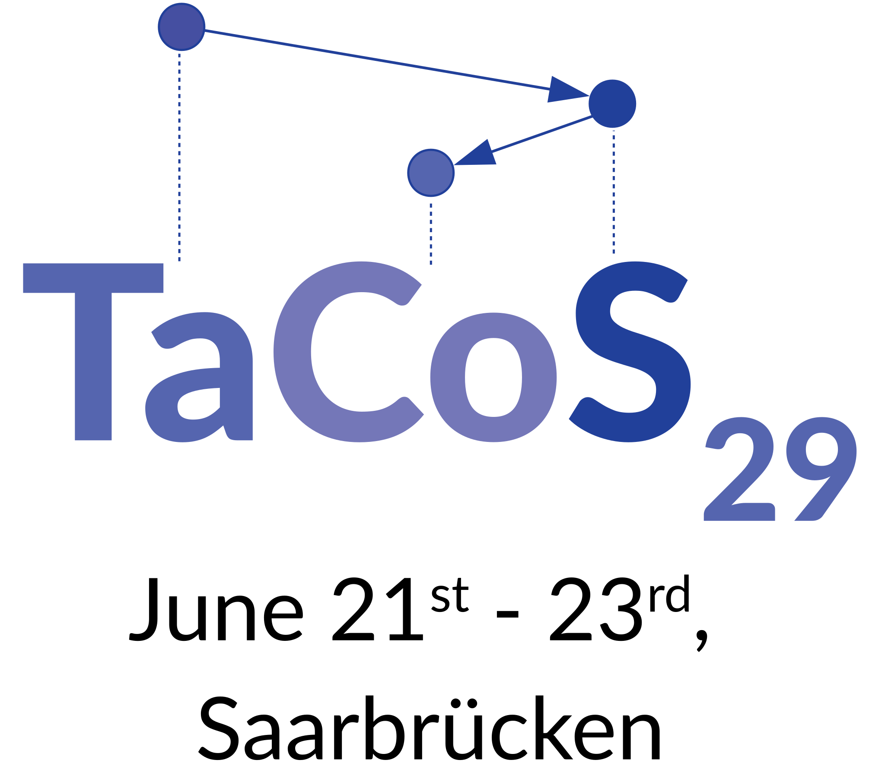

<!--

-->

  

    

        
    

  

  

    

      <h2>About TaCoS 29</h2>

We are excited to host the TaCoS 29 (Tagung der Computerlinguistik-Studierenden) in Saarbrücken in 2019. TaCoS is a conference series dating back to the 90s that is open to any student interested in the areas of computational linguistics and natural language processing as well as its neighboring applied and theoretical disciplines from psycholinguistics to computer science.

As such, the topics covered at any TaCoS are very broad. 

While the time at TaCoS is mainly spent on scientific exchange, it's also a great place to get to know each other better and build bridges.

We hope you had a great time here in Saarbrücken.

**TaCoS 30 will take place in [Heidelberg](https://fachschaft.cl.uni-heidelberg.de/) :)**

    

  

  

    

        <h2>Timeline</h2>

<table class="timeline-table">
  <tr>
    <th>Date</th>
    <th>Event</th>
  </tr>
  <tr>
    <td>April 25</td>
    <td>Registration opens</td>
  </tr>
  <tr>
    <td>- May 26</td>
    <td>Early Bird Registration (registration fee 20€)</td>
  </tr>
  <tr>
    <td>- June 9 </td> <!-- (<strong id="registration"></strong> left) -->
    <td>Registration Period (registration fee 25 €)</td>
  </tr>
  <tr>
    <td>- June 9</td>
    <td>Call for Presentations</td>
  </tr>
    <tr>
    <td>June 21-23</td>
    <td>TaCoS 29</td>
  </tr>
</table>
    

  

  

  

    

        <h2>Sponsors</h2>
        <ul>
        

            
            
            
            
            
        

        </ul>
        <ul>
        

            <strong>Fakultätsrat der philosophischen Fakultät der Universität des Saarlandes</strong>
            
        

        </ul>
<!--
        

            
        

-->
        
    

  

